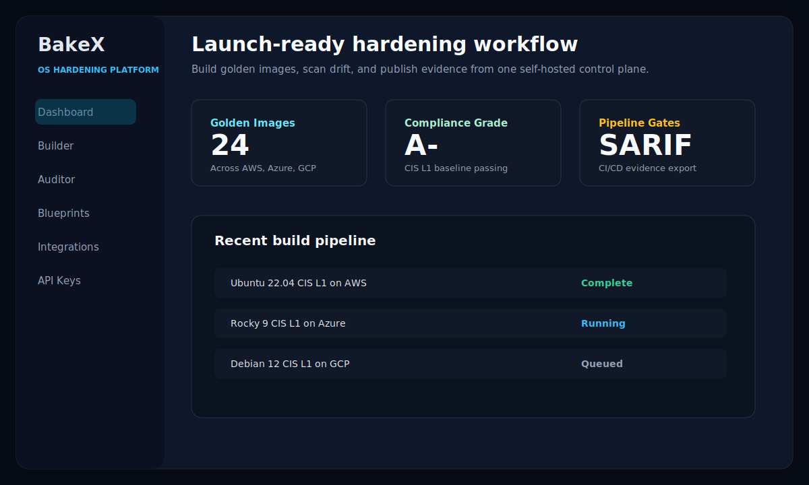
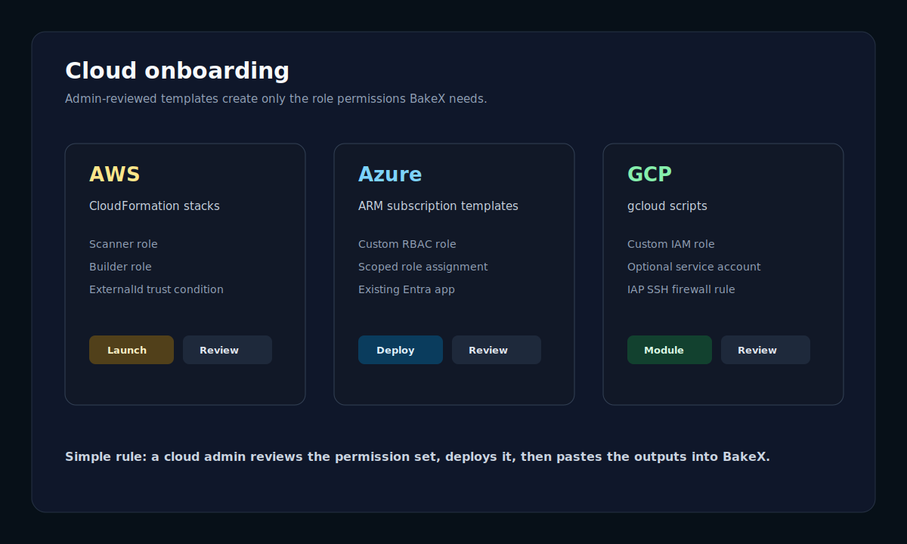
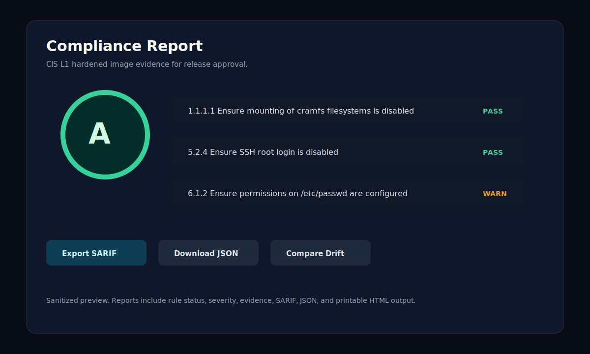

# BakeX

**Describe your hardened OS in a YAML blueprint; BakeX builds the CIS/STIG-benchmarked golden image on any cloud — or locally on KVM — and hands you the compliance evidence.**

[](https://pypi.org/project/bakex/)
[](LICENSE)
[](https://www.python.org/)
[](https://github.com/invicton/bakex/actions/workflows/ci.yml)
[](https://scorecard.dev/viewer/?uri=github.com/invicton/bakex)
[](https://github.com/invicton/bakex/releases)

<p align="center">
  
</p>

## Why BakeX

Hardened image builds are usually manual, non-reproducible, and audited in a
scramble: someone runs a checklist against a VM, someone else screenshots the
scanner output, and six months later nobody can say why a rule was disabled.
BakeX collapses that into one version-controlled YAML file — the blueprint —
and gives every build the same pipeline: provision, harden with
[Ansible-Lockdown](https://github.com/ansible-lockdown), scan with OpenSCAP,
snapshot, tear down. Your security team gets an A–F grade and a SARIF report;
your platform team gets a golden image and a `curl` one-liner to rebuild it.

## How It Works

```
HardeningBlueprint (YAML)  ──or──  5-Step Guided Wizard
        │
        ▼
  ┌─────────────────────────────────────────────────────┐
  │  BakeX Engine                                      │
  │                                                      │
  │  1. Provision  →  Spin up a temporary VM             │
  │  2. Harden     →  Apply Ansible-Lockdown CIS/STIG    │
  │  3. Scan       →  Run OpenSCAP, assert compliance    │
  │  4. Snapshot   →  Capture as reusable golden image   │
  │  5. Teardown   →  Remove the ephemeral build VM      │
  └─────────────────────────────────────────────────────┘
        │
        ▼
  Golden Image  (AMI · GCP Custom Image · Azure Managed Image · Snapshot · qcow2)
        │
        ▼
  ┌─────────────────────────────────────────────────────┐
  │  Compliance Scanner                                  │
  │                                                      │
  │  Scan any image or running VM at any time            │
  │  A–F grade  ·  SARIF export  ·  Drift analysis       │
  │  CI/CD pipeline gate  ·  Webhook notifications       │
  └─────────────────────────────────────────────────────┘
```

## Quick Start

### Docker Compose (recommended — everything preinstalled)

```bash
git clone https://github.com/invicton/bakex.git
cd bakex
docker compose up
```

Open **http://localhost:8001**. Log in with any username and your admin token
as the password — it's auto-generated on first start and saved to
`data/.admin_token` (set `BAKEX_ADMIN_TOKEN` and `BAKEX_SECRET_KEY` in
`docker-compose.yml` for stable logins and credentials that survive rebuilds).

Compose mounts `~/.aws`, `~/.config/gcloud`, and `~/.ssh` read paths plus
persistent `./data`, `./profiles`, and `./plugins/providers` automatically.

### Published image

```bash
docker run -p 8000:8000 rrskris/bakex:latest
```

### PyPI

```bash
pip install "bakex[all-providers]"   # or pick extras: aws, gcp, azure, linode, digitalocean, proxmox
bakex serve --port 8000              # or: uvicorn bakex.main:app --port 8000
```

`bakex version` prints the build; `bakex serve --help` lists options.

Built-in blueprint templates and the provider catalog ship inside the package,
so this works from any directory; runtime state (`data/`, `profiles/user/`) is
created where you launch. Ansible and OpenSCAP must be on the host for real
builds — see [Configuration](docs/configuration.md).

### From source (contributors)

```bash
git clone https://github.com/invicton/bakex.git && cd bakex
uv sync --extra all-providers --group dev
cp .env.example .env
uv run uvicorn bakex.main:app --reload --port 8000
```

**No cloud account?** The `kvm` provider builds hardened qcow2/raw images
entirely on your machine (QEMU/KVM + `cloud-image-utils` required). Full
first-run walkthrough: [Getting Started](docs/getting-started.md).

## Features

- **Declarative blueprints** — one YAML file captures OS, provider, compliance
  tier, per-rule overrides *with justifications*, filesystem, and users;
  version-controllable, diffable, reviewable
- **Three build paths** — 5-step wizard (UI), blueprint file (GitOps), or
  **AI Builder** (plain English → the agent writes the blueprint, builds, and
  iterates until the grade passes; Anthropic/OpenAI/Ollama/Bedrock backends)
- **CIS L1, CIS L2, and STIG** — via Ansible-Lockdown roles with pinned
  known-good versions, scanned natively by `oscap xccdf eval`
- **A–F compliance grade** — weighted findings, configurable pass threshold,
  embeddable SVG badge per scan
- **Evidence exports** — printable HTML, SARIF 2.1.0 (GitHub Advanced
  Security, Azure DevOps), JSON; drift analysis between any two scans
- **Pipeline-first API** — API keys (SHA-256 at rest), HMAC-signed webhooks,
  CI gate examples for GitHub Actions/GitLab/Jenkins in the
  [Pipeline Guide](docs/pipeline.md)
- **18 ready-to-use templates** across 6 OSes and 6 providers, plus a
  growing [community blueprint library](blueprints/)

## Supported Platforms

### Operating Systems

| OS | CIS L1 | CIS L2 | STIG | Benchmark ID |
|---|---|---|---|---|
| Amazon Linux 2023 | ✓ | ✓ | — | `AMAZON_LINUX_2023` |
| Ubuntu 22.04 LTS | ✓ | ✓ | — | `UBUNTU2204` |
| Ubuntu 24.04 LTS | ✓ | ✓ | — | `UBUNTU2404` |
| Rocky Linux 9 | ✓ | ✓ | ✓ | `RHEL-9` |
| RHEL 9 | ✓ | ✓ | ✓ | `RHEL-9` |
| AlmaLinux 9 | ✓ | ✓ | — | `RHEL-9` |
| Debian 12 | ✓ | ✓ | — | `DEBIAN12` |

### Providers

| Provider | Artifact | Auth |
|---|---|---|
| AWS | AMI | IAM role, `~/.aws/credentials`, or env vars |
| GCP | Custom Image | Application Default Credentials |
| Azure | Managed Image | Service Principal or Managed Identity |
| DigitalOcean | Snapshot | API token |
| Linode | Private Image | API token |
| Proxmox | VM Template | API token or username/password |
| KVM (local) | qcow2 / raw | none — runs on the BakeX host |

Cloud onboarding uses reviewable least-privilege templates
(CloudFormation / ARM / `gcloud` scripts) — see
[Cloud Onboarding](docs/cloud-onboarding.md).

## Screenshots

| Cloud onboarding | Compliance evidence |
|---|---|
|  |  |

> Screenshots are sanitized previews with no customer credentials or account data.

## Documentation

| Guide | Purpose |
|---|---|
| [Getting Started](docs/getting-started.md) | Zero → hardened golden image with compliance evidence |
| [Blueprint Guide](docs/blueprint-guide.md) | `HardeningBlueprint` schema, examples, templates |
| [Configuration](docs/configuration.md) | Environment variables, LLM backends, system dependencies |
| [Cloud Onboarding](docs/cloud-onboarding.md) | AWS, Azure, GCP admin permission model |
| [Pipeline Guide](docs/pipeline.md) | CI/CD integration, SARIF export, Blueprint-as-Code |
| [API Reference](docs/api.md) | Core REST endpoints and payloads |
| [Plugin Guide](docs/plugin-guide.md) | Writing and distributing provider plugins |
| [Architecture](docs/architecture.md) | Pipeline state machine, source tree, design decisions |
| [Blueprint Library Guide](blueprints/CONTRIBUTING.md) | Contributing community blueprints |
| [Roadmap](ROADMAP.md) | Where BakeX is headed and how to influence it |

## Contributing

Bug reports, feature requests, and PRs are welcome — see
[CONTRIBUTING.md](CONTRIBUTING.md) for the dev workflow and
[`good first issue`](https://github.com/invicton/bakex/issues?q=is%3Aissue+is%3Aopen+label%3A%22good+first+issue%22)
for curated starting points (most are pure-YAML blueprint work with acceptance
criteria and a local verify command included). Please follow the
[Code of Conduct](CODE_OF_CONDUCT.md). Found a security issue? See
[SECURITY.md](SECURITY.md) instead of opening a public issue.

## License

Apache 2.0 — see [LICENSE](LICENSE).

Built by [Vamshi Krishna Santhapuri](https://linuxcent.com).
